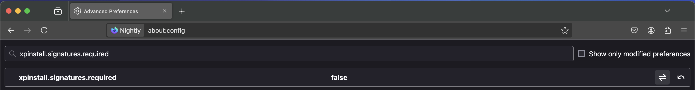
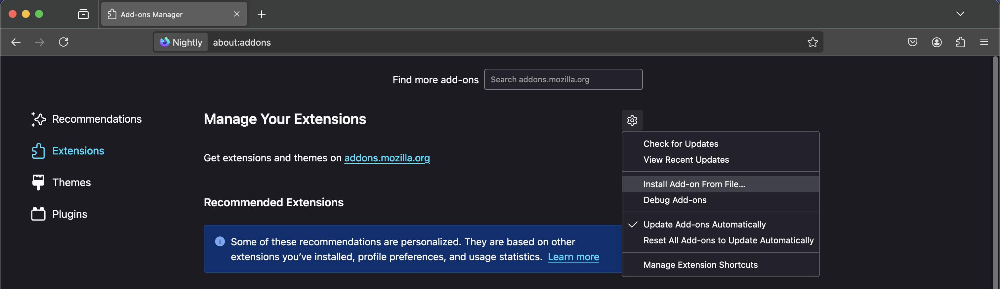
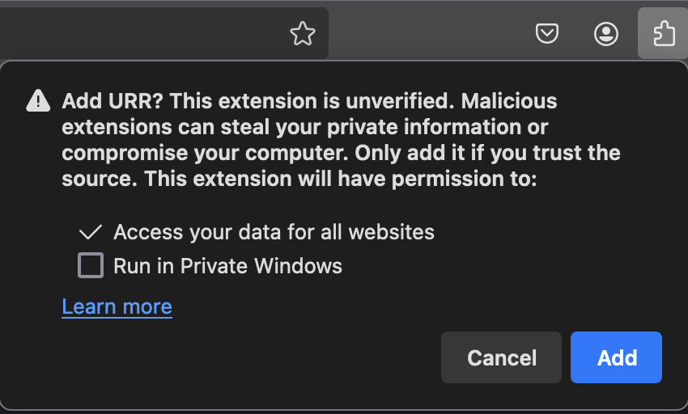

# Unbundle-Rewrite-Rebundle

This repository contains the browser extension associated with the CCS'24 paper, "Unbundle-Rewrite-Rebundle: Runtime Detection and Rewriting of Privacy-Harming Code in JavaScript Bundles."

Zenodo
--------

We will make additional artifacts available on Zenodo, and include a link here.

Browser Extension
--------

> Download the URR browser extension here: 

The URR browser extension can be added to [**Firefox Nightly**](https://www.mozilla.org/en-US/firefox/channel/desktop/). 

In order to load the unsigned extension, open Firefox Nightly and navigate to `about:config`. If prompted, click on `Accept Risk and Continue`. Thereafter, search for the flag `xpinstall.signatures.required` and set its value to `False`. We will have to adjust this flag for each browser profile we create during our evaluation. Fret not! The corresponding README will remind you to do adjust the flag.



To then add the extension to your browsing instance, navigate to `about:addons`. Click on the gear icon and choose `Install Add-on From File` from the drop-down menu. Choose the extension's zip file.



If prompted to confirm adding the extension, click `Add`.



That's it! The extension has now been added to your browser instance!


Citation
--------

If you use URR in your research, please cite our CCS 2024 publication on the framework. You can use the following BibTeX.

```
@inproceedings{ali2024urr,
  author = {Ali, Mir Masood and Snyder, Peter and Kanich, Chris and Haddadi, Hamed},
  title = {{Unbundle}-{Rewrite}-{Rebundle}: {Runtime} Detection and Rewriting of Privacy-Harming Code in {JavaScript} Bundles},
  booktitle = {ACM SIGSAC Conference on Computer and Communications Security},
  address = {Salt Lake City, USA},
  publisher = {ACM},
  month = oct,
  year = {2024},
}
```

License
--------

URR is licensed under GNU GPLv3.